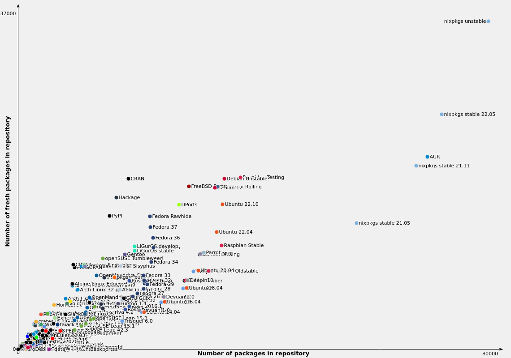

# Nix


---

## Preface

I'm biased <!-- .element: class="fragment" -->

You know this already 🤷 <!-- .element: class="fragment" -->

---


---

## Nix Ecosystem <!-- .slide: class="fragmented-lists" -->

* Nix language <!-- .element: data-fragment-index="4" -->
* Nix build system <!-- .element: data-fragment-index="3" -->
* Nix as a package manager <!-- .element: data-fragment-index="2" -->
* Nix for development environments <!-- .element: data-fragment-index="1" -->
* ~~Nix as Docker image builder~~
* ~~Nix for home directories~~
* ~~NixOS~~
* ~~NixOS clusters~~
* ~~Nix for Infrastructure as Code~~
* ~~Nix for software / system / cluster tests~~

---

## Why

<p class="fragment">Reproducibility<span class="fragment">?</span></p>


---

## Reproduciblity <!-- .slide: class="fragmented-lists" -->

Today

```console
# apt-get install ruby
# ruby --version
2.7.0
```

Tomorrow

```console
# apt-get install ruby
# ruby --version
3.0.0
```

🤷 <!-- .element: class="fragment" -->

---

## Reproduciblity

Today

```console
$ npm install
$ jq .version node_modules/axios/package.json
"1.0.0"
```

Tomorrow

```console
$ npm install
$ jq .version node_modules/axios/package.json
"1.0.0"
```

Lock files! 🎉 <!-- .element: class="fragment" -->

---

## Reproducibility

👩‍💻 Alice

```console
$ npm install
```

👨‍💻 Bob

```console
$ npm install
npm WARN EBADENGINE Unsupported engine
npm WARN EBADENGINE   required: { node: '>= 19.0.0' },
npm WARN EBADENGINE   current: { node: 'v18.12.1' }
...
```

Lock files? 🤷 <!-- .element: class="fragment" -->

---

## Reproducibility

Ruby has `rbenv`! <span class="fragment">Meh.</span>

```console
$ bundle
...
ld: cannot find -lz: No such file or directory
...
An error occurred while installing mysql2 (0.5.4), and Bundler cannot continue.
```
<!-- .element: class="fragment" -->

'Native' dependencies are 'special' 🤷 <!-- .element: class="fragment" -->

---

## Solution <!-- .slide: class="fragmented-lists" -->

Docker! <span class="fragment">Right?</span>

* Containers
* Composability
* Big binary blobs
* VM on OSX

---

## Let's dive into Nix

* `nix run`
* `nix shell`
* `nix develop`
* (`nix profile install`)

---

## Install

https://nix.dev/tutorials/install-nix

* Docker

  ```sh
  docker run -it nixos/nix
  ```

* ArchLinux

  ```sh
  sudo pacman -S nix
  sudo usermod --append --groups nix-users $USER
  ```

* Debian

  ```sh
  sh <(curl -L https://nixos.org/nix/install) --daemon
  ```

* MacOS

  ```sh
  sh <(curl -L https://nixos.org/nix/install)
  ```

---

## Experimental features <!-- .slide: class="fragmented-lists" -->

* Major improvements to CLI (`nix-command`)
* Structured Nix files (`flakes`)
* Why?
  * Essential
  * Experimental for ~4 years
  * Usage from > 40% of community
* Biggest downside of Nix atm (IMO)

---

## Configure experimental features

Add to `~/.config/nix/nix.conf` and `/etc/nix/nix.conf`

```text
experimental-features = nix-command flakes
```

On Debian and Archlinux:

```console
$ systemctl restart nix-daemon
```

---

## Nix run

```console [1-2|3-11]
$ cowsay
bash: cowsay: command not found
$ nix run nixpkgs#cowsay -- hello
 _______ 
< hello >
 ------- 
        \   ^__^
         \  (oo)\_______
            (__)\       )\/\
                ||----w |
                ||     ||
```
<!-- .element: class="fragment" -->

---

## Nix run

It is a full blown package manager...

```console
$ nix run nixpkgs#firefox
```

---

## Nix run

It does not clutter your `/usr/bin`...

```console
$ nix run nixpkgs#firefox
$ firefox
bash: firefox: command not found
```

<div class="fragment">

It does clutter your `/nix/store`...

```console
/nix/store/klwh0pr14pyam1l7nclr7nsq53ijbj98-firefox-107.0/bin/firefox
```

</div>

---

## Nix shell

```console [1|2-3|4]
$ nix shell nixpkgs#nodejs
$ node --version
v18.12.1
$ exit
```
<!-- .element: class="fragment" -->

---

## Nix shell

```console [|1-2|3|4-5|6-7]
$ jq
bash: jq: command not found
$ nix shell nixpkgs#jq
$ jq
$ exit
$ jq
bash: jq: command not found
```

---

## References

```console
$ nix shell nixpkgs#nodejs
$ node --version
v18.12.1
```
<!-- .element: class="fragment" -->

```console
$ nix shell github:nixos/nixpkgs/nixos-unstable#nodejs
$ node --version
v18.12.1
```
<!-- .element: class="fragment" -->

```console
$ nix shell github:nixos/nixpkgs/nixos-20.03#nodejs
$ node --version
v10.19.0
```
<!-- .element: class="fragment" -->

```console
$ nix shell github:nixos/nixpkgs/1db42b7fe3878f3f5f7a4f2dc210772fd080e205#nodejs
$ node --version
v10.19.0
```
<!-- .element: class="fragment" -->

---

## Composition

```console
$ nix shell nixpkgs#{nodejs,ruby}
$ ruby --version
ruby 2.7.6p219 (2022-04-12 revision c9c2245c0a) [x86_64-linux]
$ node --version
v18.12.1
```
<!-- .element: class="fragment" -->

```console
$ nix shell \
    nixpkgs#ruby \
    github:nixos/nixpkgs/nixos-20.03#nodejs
$ ruby --version
ruby 2.7.6p219 (2022-04-12 revision c9c2245c0a) [x86_64-linux]
$ node --version
v10.19.0
```
<!-- .element: class="fragment" -->

---

## Nix develop

<p class="fragment">A stable shell <span class="fragment">with a lock file 🥳</span></p>

---

## Nix develop

```console
$ mkdir ~/projects/myproject
$ git init
$ nix flake init --template github:bobvanderlinden/templates#dev-shell
```

---

## `flake.nix`

```nix [3|13-17|15]
{
  inputs = {
    nixpkgs.url = "github:NixOS/nixpkgs/nixos-22.05";
  };

  outputs = { self, nixpkgs, flake-utils }: {
    devShell = nixpkgs.lib.genAttrs [
        "x86_64-linux"
        "aarch64-darwin"
      ] (system:
      let pkgs = import nixpkgs { inherit system; };
      in {
        devShell = pkgs.mkShell {
          buildInputs = with pkgs; [
            nodejs
            ruby
          ];
        };
      }
    );
}
```

---

## `flake.lock`

* Sits next to `flake.nix`
* Holds Git revisions of inputs
* `nix flake update`

---

## Nix develop

```console [|2-4]
$ nix develop
$ node --version
v16.17.1
$ exit
$ node --version
node: command not found
```

---

## Nix develop

You can use globally installed tools...

```console
$ nix develop
$ code .
$ idea .
$ git pull origin master
```

---

## The magic

* VM? <!-- .element: class="fragment" -->
* Containers? <!-- .element: class="fragment" -->
* Environment variables! <!-- .element: class="fragment" -->

```consoles
$ nix develop
$ echo $PATH
...:/nix/store/akfdiq8w936a8ah16k39scpi8094czb1-nodejs-16.17.1/bin:...:/usr/bin
```
<!-- .element: class="fragment" -->

---

## Flake in practice (Ruby)

```nix [|3|4|5|6-10|11|14-16]
mkShell {
  nativeBuildInputs = with pkgs; [
    ruby_3_1
    sqlite
    mariadb.client
    libmysqlclient
    automake
    pkg-config
    augeas
    libxml2
    github-changelog-generator
  ];

  shellHook = ''
    echo Welcome to my project!
    export BUNDLE_PATH="$PWD/.data/gems"
  '';
}
```

---

## Ruby flake in practice

```console [1|2|3-4|5|6-7]
$ nix develop
Welcome to my project!
$ bundle
# Installing gems
# Compiling native gems
$ bundle exec rails server
# Navigate to http://localhost:3000/
```

---

## Nix as package manager <!-- .slide: class="fragmented-lists" -->

```console
$ nix profile install nixpkgs#firefox
$ firefox
$ nix profile remove nixpkgs#firefox
```
<!-- .element: class="fragment" -->

* No root! ✨
* Per-user profile 🎉
* `~/.nix-profile/bin`
* 'Globals' 👎

---

## Package availability

https://repology.org/

 <!-- .element: class="fragment" -->

---

## Finding packages

https://search.nixos.org/packages

---

## The workflow

```console [1|2|4|5|6|7|]
$ cd projecta
$ nix develop
$ # Do my thing
$ exit
$ cd ..
$ cd projectb
$ nix develop
...
```

 <!-- .element: class="fragment" -->

That's a lot of work! <!-- .element: class="fragment" -->

---
## direnv

A shell extension for<br>
automatically loading<br>
project environment variables

```console [1-3|4-5|6-7|8-10]
$ cd myproject
direnv: loading .envrc                                     
direnv: export +DATABASE_HOST +DATABASE_PASSWORD +DATABASE_PORT +DATABASE_USER
$ echo $DATABASE_HOST
localhost
$ cd ..
direnv: unloading
$ echo $DATABASE_HOST

$
```
<!-- .element: class="fragment" -->

---

## `.envrc`

`direnv` project confguration file

```bash
export DATABASE_HOST=localhost
export DATABASE_PORT=1234
export DATABASE_USER=admin
export DATABASE_PASSWORD=secret
```
<!-- .element: class="fragment" -->

---

## nix-direnv

A plugin for `direnv`

```console [1-5|6-7|8-9|10-11]
$ cd myproject
direnv: loading .envrc                                 
direnv: using flake
direnv: nix-direnv: renewed cache
direnv: export ... ~PATH ...
$ node --version
v16.17.1
$ cd ..
direnv: unloading
$ node --version
bash: node: command not found
```
<!-- .element: class="fragment" -->

---

## `.envrc`

```bash
use flake
```

---

## Install direnv

```console
$ nix profile install nixpkgs#direnv
```

Add to `~/.bashrc`:

```bash
eval "$(direnv hook bash)"
```

Add to `~/.zshrc`:

```bash
eval "$(direnv hook zsh)"
```

Add to `~/.config/fish/config.fish`:

```bash
>direnv hook fish | source
```

---

## Install nix-direnv

```console
$ nix profile install nixpkgs#nix-direnv
```

Add to `~/.direnvrc`:

```bash
source $HOME/.nix-profile/share/nix-direnv/direnvrc
```

---

## Recap

* `nix run` runs package ad-hoc
* `nix shell` opens ad-hoc shell
* `nix develop` opens `devShell` defined in `flake.nix`
* `flake.nix` has a lock file
* `direnv` automatically loads environment variables upon entering directory
* `nix-direnv` loads environment variables from `nix develop`

---

## Caveats <!-- .slide: class="fragmented-lists" -->

* Flakes are experimental
* CLI is experimental
* Documentation covers non-experimental
* Documentation varies in quality
* Nix language is purely functional
* Steep learning curve
* Creating project setup can be fiddly, like Dockerfile
* Usage should be easy

---

## Community work

* devshell (https://github.com/numtide/devshell)
* devenv (https://devenv.sh/)
* flox (https://floxdev.com/)

---

## Slides

https://bobvanderlinden.github.io/nix-workshop/

<qrcode href="https://bobvanderlinden.github.io/nix-workshop/" />

---

## Host slides locally

```console
$ nix run github:bobvanderlinden/nix-workshop
```

---

## Host slides using Docker 🤭

```console
$ nix build github:bobvanderlinden/nix-workshop#dockerImage
$ docker load < result
$ docker run -it nix-workshop:XXX
```

---

# Neat: build and run freegish

```console
nix run github:freegish/freegish
```

---

## Neat: SBOM generation

```console
nix show-derivation --recursive | nix run github:sudo-bmitch/convert-nix-cyclonedx#
```

---

## The end<span class="fragment">?</span>

---

## Version not available

```nix
let
  mysql-5_7 = pkgs.mysql57.overrideAttrs (oldAttrs: rec {
    version = "5.7.29";
    src = pkgs.fetchFromGitHub {
      owner = "mysql";
      repo = "mysql-server";
      rev = "mysql-${version}";
      hash = "sha256-uGjyDWX+Hhg582DvZDuS+iPTPyVA5Hz6dl1no7TNFac=";
    };
  });
in mkShell {
  buildInputs = [ mysql-5_7 ];
}
```

https://github.com/mysql/mysql-server/tree/mysql-5.7.29

---

## Nix language <!-- .slide: class="fragmented-lists" -->

* Strings
  
  ```nix
  "this is a string"
  ```

* Multi-line strings
  
  ```nix
  ''
  This is
  a multiline
  string
  ''
  ```

---

## Nix language <!-- .slide: class="fragmented-lists" -->

* Lists

  ```nix
  [ 1 2 3 ]
  ```

* Attribute sets (attrs)

  ```nix
  {
    keyA = 3;
    keyB = 4;
  }
  ```

* Variable declaration
  
  ```nix
  let
    variableA = 3;
    variableB = 4;
  in
    variableA + variableB
  ```

---

## Nix language <!-- .slide: class="fragmented-lists" -->

* Functions
  
  ```nix
  let
    funA = arg: arg + 2;
  in
    funA 3
  ```

* Multiple arguments (currying)

  ```nix
  let
    funB = argA: argB: argA + argB;
  in
    funB 1 2
  ```

* Argument destructuring

  ```nix
  { paramA, paramB }: paramA + paramB
  ```

---

## Nix language <!-- .slide: class="fragmented-lists" -->

* Deep attribute sets
  
  ```nix
  {
    this.is.deep = 3;
    this.is.too = 4;
  }
  ```

  equals

  ```nix
  {
    this = {
      is = {
        deep = 3;
        too = 4;
      };
    };
  }
  ```

## Nix language <!-- .slide: class="fragmented-lists" -->

* Recursive attribute sets

  ```nix
  rec {
    valueA = 3;
    valueB = valueA + 1;
  }
  ```
