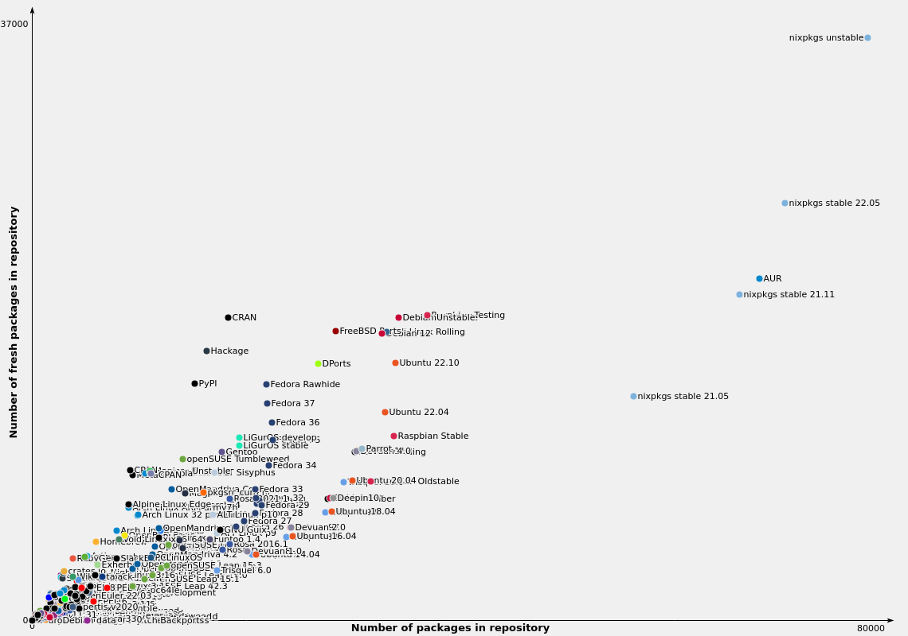

# Nix


---

## Preface

I'm biased <!-- .element: class="fragment" -->

You know this already 🤷 <!-- .element: class="fragment" -->

---

## Nix Ecosystem <!-- .slide: class="fragmented-lists" -->

* Nix language <!-- .element: data-fragment-index="4" -->
* Nix build system <!-- .element: data-fragment-index="3" -->
* Nix as a package manager <!-- .element: data-fragment-index="2" -->
* Nix for development environments <!-- .element: data-fragment-index="1" -->
* ~~NixOS~~
* ~~NixOS clusters~~
* ~~Infrastructure as Code~~

---

## Why

<p class="fragment">Reproducibility<span class="fragment">?</span></p>


---

## Reproduciblity <!-- .slide: class="fragmented-lists" -->

Today

```console
# apt-get install ruby
# ruby --version
2.7.0
```

Tomorrow

```console
# apt-get install ruby
# ruby --version
3.0.0
```

🤷 <!-- .element: class="fragment" -->

---

## Reproduciblity

Today

```console
$ npm install
$ jq .version node_modules/axios/package.json
"1.0.0"
```

Tomorrow

```console
$ npm install
$ jq .version node_modules/axios/package.json
"1.0.0"
```

Lock files! 🎉 <!-- .element: class="fragment" -->

---

## Reproducibility

👩‍💻 Alice

```console
$ npm install
```

👨‍💻 Bob

```console
$ npm install
npm WARN EBADENGINE Unsupported engine
npm WARN EBADENGINE   required: { node: '>= 19.0.0' },
npm WARN EBADENGINE   current: { node: 'v18.12.1' }
...
```

Lock files? 🤷 <!-- .element: class="fragment" -->

---

## Reproducibility

Ruby has `rbenv`! <span class="fragment">Meh.</span>

<pre class="fragment">
$ bundle
...
ld: cannot find -lz: No such file or directory
...
An error occurred while installing mysql2 (0.5.4), and Bundler cannot continue.
</pre>

'Native' dependencies are 'special' 🤷 <!-- .element: class="fragment" -->

---

## Solution <!-- .slide: class="fragmented-lists" -->

Docker! <span class="fragment">Right?</span>

* Containers
* Composability
* Big binary blobs
* VM on OSX

---

## Let's dive into Nix

* `nix run`
* `nix shell`
* `nix develop`

---

## Nix run

```console
$ cowsay
bash: cowsay: command not found
$ nix run nixpkgs#cowsay -- hello
 _______ 
< hello >
 ------- 
        \   ^__^
         \  (oo)\_______
            (__)\       )\/\
                ||----w |
                ||     ||
```

---

## Nix run

It is a full blown package manager...

```console
$ nix run nixpkgs#firefox
```

---

## Nix run

It does not clutter your `/usr/bin`...

```console
$ nix run nixpkgs#firefox
$ firefox
bash: firefox: command not found
```

<div class="fragment">

It does clutter your `/nix/store`...

```console
/nix/store/klwh0pr14pyam1l7nclr7nsq53ijbj98-firefox-107.0/bin/firefox
```

</div>

---

## Nix shell

```console
$ nix shell nixpkgs#nodejs
$ node --version
v18.12.1
$ exit
```

---

## Nix shell

```console
$ jq
bash: jq: command not found

$ nix shell nixpkgs#jq
$ jq
$ exit

$ jq
bash: jq: command not found
```

---

## Nix shell

```console
$ nix shell github:nixos/nixpkgs/nixos-20.03#nodejs
$ node --version
v10.19.0
```

---

## Nix shell

```console
$ nix shell github:nixos/nixpkgs/nixos-20.03#nodejs
$ node --version
v10.19.0
```

---

## Nix shell

```console
$ nix shell github:nixos/nixpkgs/1db42b7fe3878f3f5f7a4f2dc210772fd080e205#nodejs
$ node --version
v10.19.0
```

---

## Nix shell

```console
$ nix shell github:nixos/nixpkgs/nixos-20.03#{nodejs,ruby}
$ ruby --version
ruby 2.6.6p146 (2020-03-31) [x86_64-linux]
```

On Apple M1 you'll get:

```console
$ nix shell github:nixos/nixpkgs/nixos-20.03#{nodejs,ruby}
$ ruby --version
ruby 2.6.6p146 (2020-03-31) [aarch64-darwin]
```

---

## Nix develop

* A stable shell
* with a lock file
* exposing development files

---

## Nix develop

```console
$ cd ~/projects/nedap/cupido
$ nix flake init --template github:bobvanderlinden/templates#dev-shell
```

---

## `flake.nix`

<!-- .slide data-auto-animate -->

```nix [3|11-15]
{
  inputs = {
    nixpkgs.url = "github:NixOS/nixpkgs/nixos-22.05";
    flake-utils.url = "github:numtide/flake-utils";
  };

  outputs = { self, nixpkgs, flake-utils }:
    flake-utils.lib.eachDefaultSystem (system:
      let pkgs = import nixpkgs { inherit system; };
      in {
        devShell = pkgs.mkShell {
          buildInputs = with pkgs; [

          ];
        };
      }
    );
}
```

---

## `flake.nix`

```nix [13]
{
  inputs = {
    nixpkgs.url = "github:NixOS/nixpkgs/nixos-22.05";
    flake-utils.url = "github:numtide/flake-utils";
  };

  outputs = { self, nixpkgs, flake-utils }:
    flake-utils.lib.eachDefaultSystem (system:
      let pkgs = import nixpkgs { inherit system; };
      in {
        devShell = pkgs.mkShell {
          buildInputs = with pkgs; [
            nodejs
          ];
        };
      }
    );
}
```

---



---

## Install

https://nix.dev/tutorials/install-nix

* Docker

  ```sh
  docker run -it nixos/nix
  ```

* ArchLinux

  ```sh
  sudo pacman -S nix
  usermod --groups nix-users $UID
  ```

* Debian

  ```sh
  sh <(curl -L https://nixos.org/nix/install) --daemon
  ```

* MacOS

  ```sh
  sh <(curl -L https://nixos.org/nix/install)
  ```
